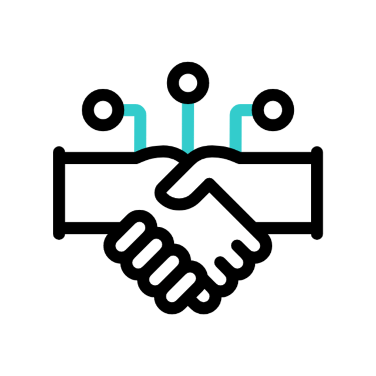

# 👋 Hi, I'm Vishwjeet Kumar

**Software Engineer | Full Stack Developer**

Dedicated software engineer with a passion for crafting scalable, high-performance systems. I thrive on solving complex problems and transforming technical challenges into efficient, reliable software that empowers business growth. Always curious, continuously learning, and driven to deliver impact through technology.

---

## ⚙️ Tech Stack & Tools

---

## 🚀 Projects

**Angel Monkey Ecommerce**  
*Dec 2024 – Jan 2025*  
Full-stack eCommerce platform built with Next.js, Laravel, MySQL, and AWS S3. Includes a robust admin dashboard, advanced caching, and scalable architecture for high performance.

**Plation at Home Ecommerce**  
*Mar 2023 – May 2024*  
Online nursery store using Angular, Laravel, and MySQL. Features a role-based admin dashboard and API-driven design for seamless management.

---

## 💼 Work Experience

**Simpliaxis Solutions Pvt. Ltd** *(Feb 2024 – Present)*  
- Developed scalable, microservices-based web applications  
- Managed build/deployment pipelines and RESTful APIs

**Volmint Technology** *(Dec 2022 – Jan 2023)*  
- Built University Management System with role-based access control  
- Enhanced security and code quality using Agile practices

**Globussoft Pvt. Ltd** *(Sep 2021 – Oct 2022)*  
- Developed client-facing responsive web applications  
- Worked on REST APIs, Docker containers, and CI/CD pipelines

---

## 🎓 Education

- **MCA**, Gaya College (Magadh University), *2020–2022*
- **BCA**, Gaya College (Magadh University), *2016–2019*

---

## 📊 GitHub Stats & Activity

  
  

  

  

---

## 🤝 Let's Collaborate!

  

*Open to collaboration, freelance work, and exciting new projects! Feel free to reach out and let’s build something amazing together.*

---

## 🔗 Connect with Me

---

## 🌱 Languages & Interests

- **Languages:** English, Hindi  
- **Interests:** Movies, Music, Sketching, Continuous Learning

---

  <b>⭐ Turning complex ideas into clean, impactful code. ⭐</b>

